# 4. Mappa dei macro-processi (workflow di business)

I diagrammi sono in [Mermaid](https://mermaid.js.org/), visualizzati direttamente da GitHub. Ogni passo riporta tra parentesi quadre gli ID dei requisiti che lo implementano.

## 4.0 Panoramica del ciclo di vita della commessa

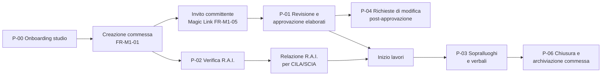

---

## P-00 — Onboarding di un nuovo studio (tenant)

**Attori:** Platform Admin, Studio Owner
**Trigger:** contratto Beta firmato con lo studio

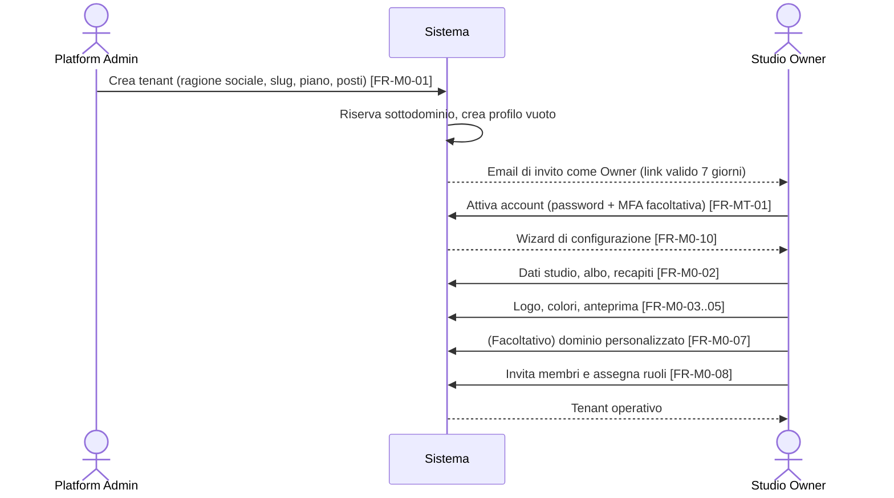

**Esito:** tenant attivo, brandizzato, con almeno un Owner.
**Eccezioni:** invito scaduto → l'Owner chiede un nuovo invito al Platform Admin; slug già in uso → il sistema propone alternative.

---

## P-01 — Flusso di approvazione degli elaborati (Studio → Cliente → Firma)

**Attori:** Architetto, Committente (firmatario e non), Sistema
**Trigger:** l'Architetto ha un elaborato pronto per la revisione del cliente
**Precondizioni:** commessa attiva; almeno un contatto committente con Magic Link attivo

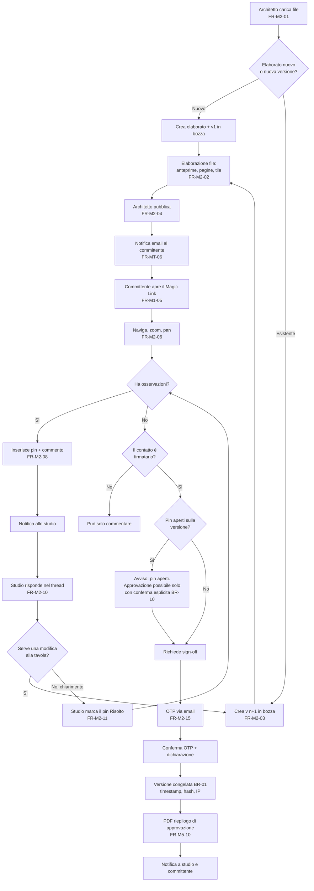

**Regole coinvolte:** `BR-01` (immutabilità), `BR-10` (sign-off solo firmatario, solo sull'ultima versione pubblicata), `BR-11` (riapertura dei pin).

**Nota sui pin tra versioni:** quando si pubblica la versione n+1, i pin **aperti** della versione n **non** si copiano automaticamente, perché le coordinate potrebbero non corrispondere più. La versione n resta consultabile con i suoi pin e il pannello della nuova versione mostra "N pin aperti sulla versione precedente", con link. Lo studio può *trasferire* un pin aperto alla nuova versione (azione manuale, Should — `FR-M2-13`).

---

## P-02 — Flusso di verifica e asseverazione R.A.I.

**Attori:** Architetto (o Collaboratore per l'inserimento), Sistema
**Trigger:** progettazione di un intervento che richiede la verifica dei requisiti igienico-sanitari

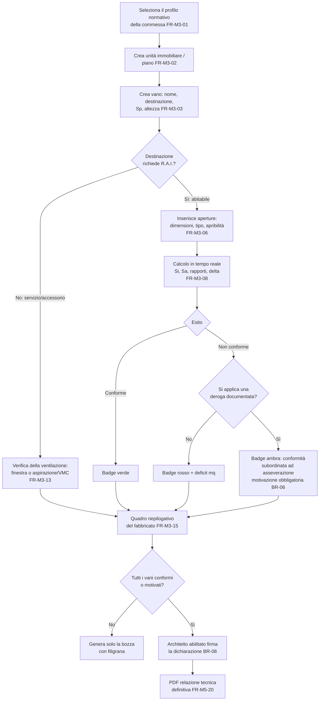

**Nota:** un vano non conforme **non blocca** la generazione della relazione in bozza. La relazione **definitiva** con asseverazione richiede invece che ogni vano sia *Conforme* o *Subordinato ad asseverazione* con motivazione (`BR-06`). Un vano *Non Conforme* impedisce l'asseverazione di conformità, ma lascia generare un **report di verifica** (non asseverativo) utile in fase di progetto.

---

## P-03 — Flusso del sopralluogo sul campo

**Attori:** Architetto con ruolo DL sulla commessa, Sistema/AI, Committente e Impresa (destinatari)
**Trigger:** visita programmata o straordinaria in cantiere

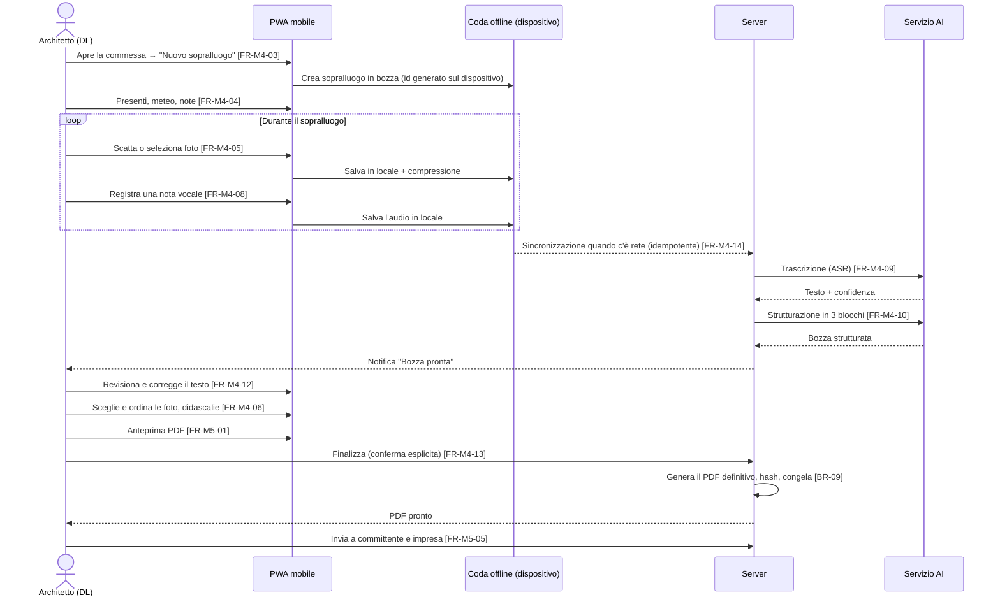

**Fallback AI:** se la trascrizione fallisce o ha confidenza bassa, l'audio grezzo resta disponibile e il DL può scrivere il testo a mano o rilanciare la trascrizione (`EC-04`, `EC-05`). Il sopralluogo si può **sempre** completare anche senza AI.

---

## P-04 — Richiesta di modifica dopo l'approvazione (gestione dello scope creep)

**Attori:** Committente, Architetto
**Trigger:** il committente vuole cambiare un elaborato già approvato

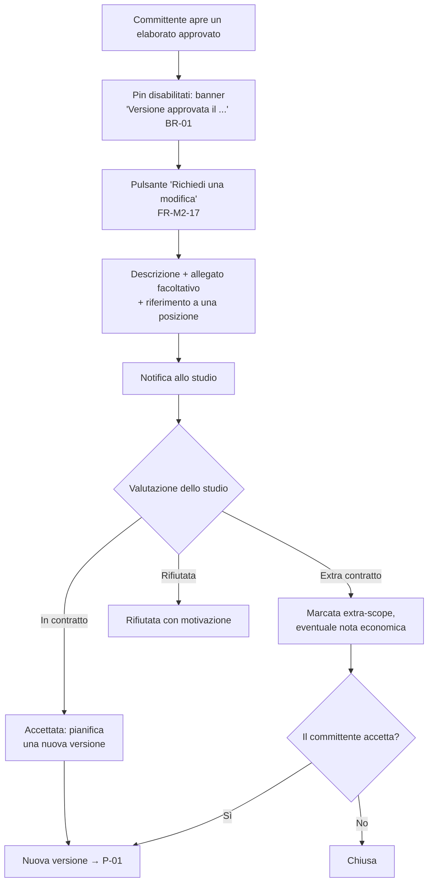

**Valore:** traccia documentale di tutte le richieste arrivate dopo il congelamento, utile per quotare le varianti e in caso di contenzioso sul compenso.

---

## P-05 — Ciclo di vita dell'accesso del committente (Magic Link)

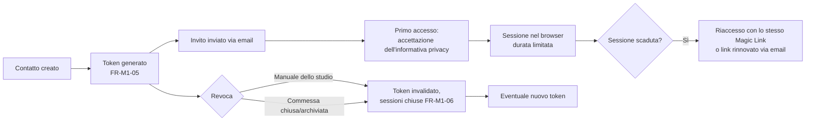

---

## P-06 — Chiusura e archiviazione della commessa

1. L'Architetto imposta la commessa su **Chiusa**: i Magic Link vengono revocati automaticamente dopo un periodo di grazia configurabile (predefinito 30 giorni) e il portale del committente diventa di sola lettura.
2. Dopo la chiusura si possono ancora consultare ed esportare i documenti.
3. **Archiviazione:** la commessa sparisce dalle liste attive ed è consultabile dal filtro "Archiviate".
4. **Eliminazione definitiva:** solo l'Owner, con doppia conferma. Non è possibile finché è attivo un vincolo di conservazione (`BR-13`).

---

## 4.7 Macchine a stati

### SM-PROGETTO (Commessa)

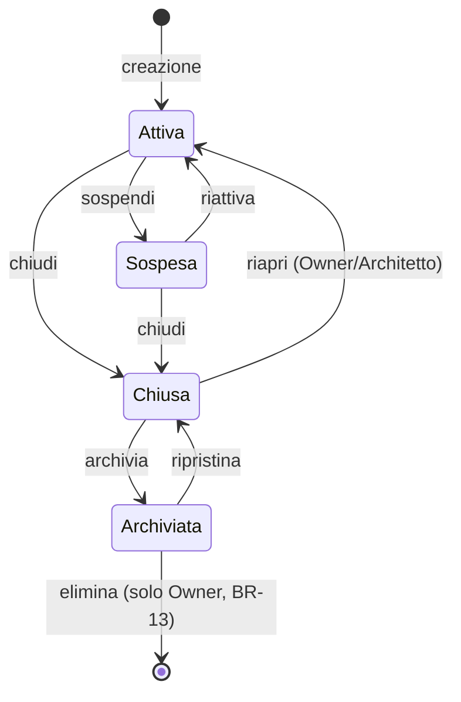

| Stato | Committente | Nuovi contenuti | Note |
|-------|-------------|-----------------|------|
| Attiva | Accesso completo | Sì | Stato normale |
| Sospesa | Sola lettura | No (tranne note interne) | Es. pratica ferma, contenzioso |
| Chiusa | Sola lettura per il periodo di grazia, poi nessun accesso | No | Lavori finiti o incarico concluso |
| Archiviata | Nessun accesso | No | Esclusa dalle liste e dai conteggi |

### SM-ELABORATO (Versione dell'elaborato)

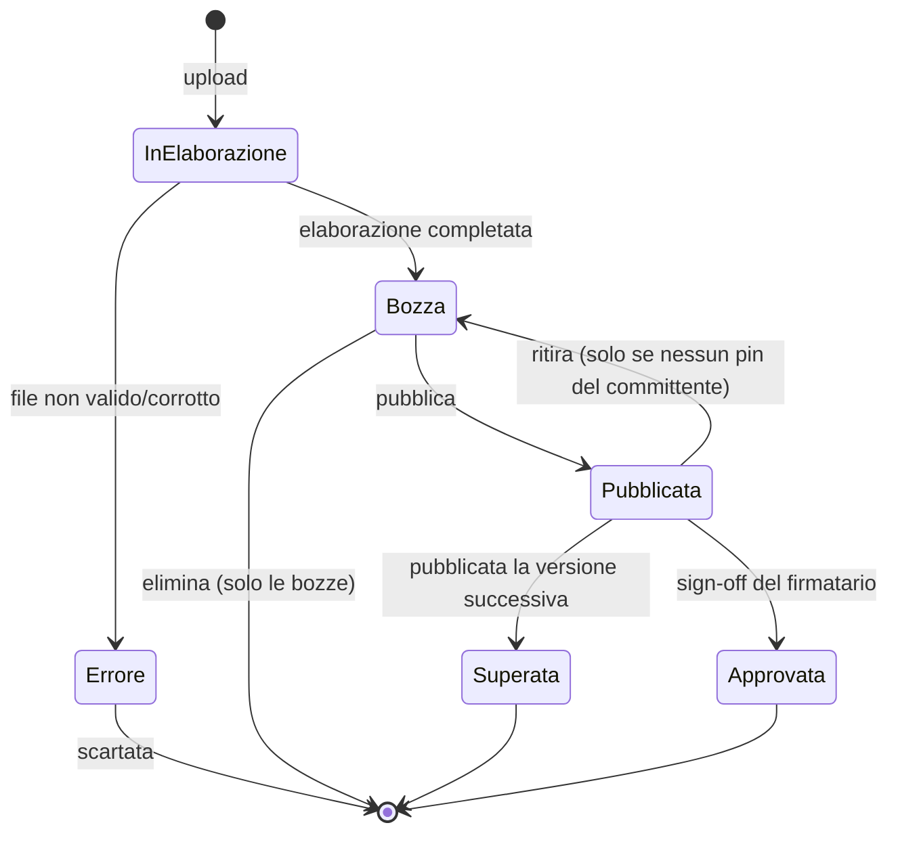

- **Superata:** consultabile, con i suoi pin in sola lettura; non si può approvare.
- **Approvata:** congelata (`BR-01`); non torna mai indietro. Per modificarla si pubblica una nuova versione, che richiede un nuovo sign-off.

### SM-PIN

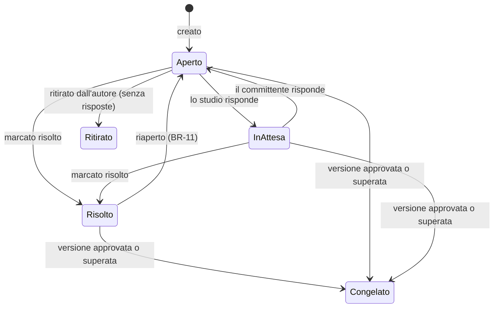

### SM-RICHIESTA-MODIFICA

`Inviata → In valutazione → (Accettata in contratto | Accettata extra-scope | Rifiutata) → Chiusa`

### SM-SOPRALLUOGO

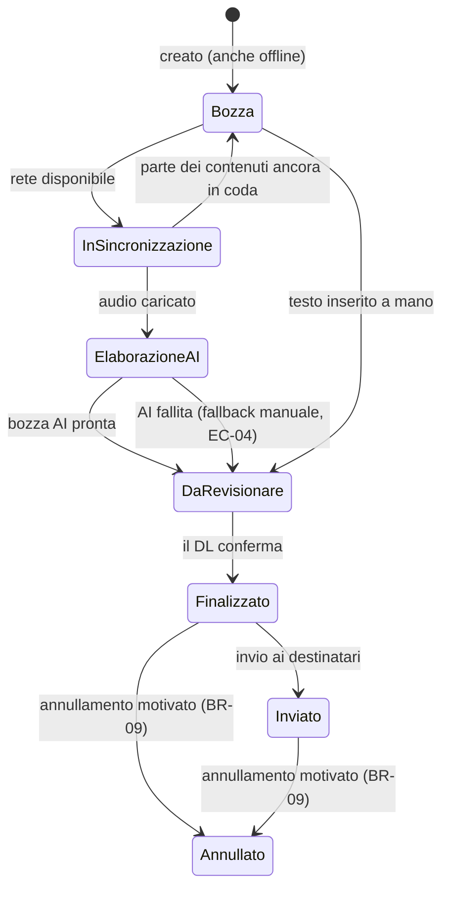

Un verbale **Annullato** resta in archivio con filigrana "ANNULLATO". Il verbale sostitutivo porta il riferimento a quello annullato.

### SM-TOKEN (Magic Link)

`Attivo → (Revocato | Scaduto)`. Non si torna indietro: la rigenerazione crea un **nuovo** token.

### SM-DOMINIO (Dominio personalizzato)

`Richiesto → In verifica DNS → Certificato in emissione → Attivo | Errore`; da `Attivo` si può passare a `Rimosso`.

### SM-JOB-AI (Trascrizione e strutturazione)

`In coda → In esecuzione → (Completato | Fallito → In coda [retry fino a 3 volte, con backoff esponenziale] | Fallito definitivamente)`
