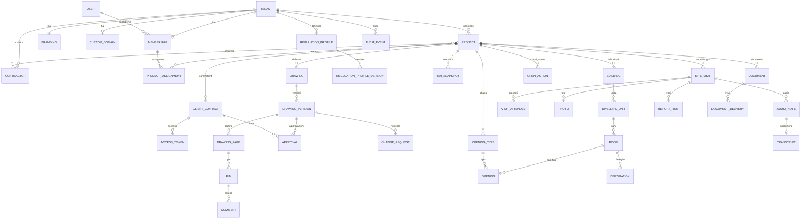

# 11. Modello dati concettuale

Modello **concettuale** (entità, attributi principali, relazioni, vincoli di dominio) per allineare funzionale e tecnico. Lo schema fisico (tipi SQL, indici, partizionamento) si definisce nei documenti tecnici e nelle migrazioni, rispettando questi vincoli. Database di riferimento: **relazionale** (PostgreSQL — vedi cap. 14).

**Convenzioni trasversali per tutte le entità del tenant:**
- `id` UUID (v7, ordinabile nel tempo; generabile anche sul client per l'offline);
- `tenantId` obbligatorio e **non modificabile** (`BR-04`);
- `createdAt`, `createdBy`, `updatedAt`, `updatedBy`;
- `deletedAt` per la cancellazione logica, dove ammessa;
- `version` intero per il controllo di concorrenza ottimistico.

## 11.1 Diagramma entità-relazioni



## 11.2 Entità principali

### Organizzazione

| Entità | Attributi principali | Vincoli |
|--------|----------------------|---------|
| **Tenant** | name, slug, status (`ACTIVE`/`SUSPENDED`/`CLOSING`/`DELETED`), plan, seats, storageQuotaBytes, audioQuotaMinutes, legal data (vatNumber, taxCode, addresses, pec, email, phone, website, legalRepresentative), settings (codePattern, graceDays, requireOtpNewDevice, signOffRule) | slug unico globale; almeno un Owner attivo (`BR-12`) |
| **User** | email (unica globale), passwordHash, mfaSecret (cifrato), firstName, lastName, title, phone, locale, timezone | Account globale, collegato ai tenant tramite Membership |
| **Membership** | tenantId, userId, role (`OWNER`/`ARCHITECT`/`COLLABORATOR`), status (`INVITED`/`ACTIVE`/`SUSPENDED`/`REMOVED`), professionalRegistration {order, number, section, sector}, signatureImageKey | (tenantId, userId) unico |
| **Branding** | logoKeys {primary, dark, icon, print}, primaryColor, secondaryColor, derivedTokens (JSON), portalTheme, documentSettings (JSON), history (ultime 10) | 1:1 con Tenant |
| **CustomDomain** | hostname, status (SM-DOMINIO), verificationRecords, certificateStatus, lastCheckAt, failures | hostname unico globale |

### Commessa

| Entità | Attributi principali | Vincoli |
|--------|----------------------|---------|
| **Project** | code, title, description, interventionType, permitType, siteAddress, geo {lat, lng}, cadastral[], municipality, altitude, regulationProfileVersionId, startDate, endDate, status, tags[], coverImageKey, closedAt | (tenantId, lower(code)) unico |
| **ProjectAssignment** | projectId, membershipId, projectRole (`LEAD`/`DESIGNER`/`SITE_DIRECTOR`/`COLLABORATOR`), validFrom, validTo | Al massimo un `SITE_DIRECTOR` attivo per progetto (`BR-17`) |
| **ClientContact** | projectId, kind, displayName, taxId, email, phone, address, roleInProject, isSigner, portalEnabled, privacyAcknowledgedAt, emailStatus (`OK`/`BOUNCED`) | — |
| **AccessToken** | clientContactId, tokenHash (SHA-256), status (`ACTIVE`/`REVOKED`/`EXPIRED`), kind (`PROJECT`/`SELF_SERVICE`), expiresAt, revokedAt, revokedBy, revokeReason, lastUsedAt | Il token in chiaro non si salva mai |
| **ClientSession** | accessTokenId, deviceFingerprintHash, createdAt, lastSeenAt, expiresAt, ipTruncated, userAgent | Revocate a cascata con il token |
| **OtpChallenge** | clientContactId, purpose (`SIGN_OFF`/`NEW_DEVICE`), codeHash, expiresAt, attempts, verifiedAt | Max 5 tentativi |
| **Contractor** | name, vatNumber, contactName, email, pec, phone, category | Rubrica per tenant |

### Revisione

| Entità | Attributi principali | Vincoli |
|--------|----------------------|---------|
| **Drawing** | projectId, title, sheetCode, category, phase, scale, clientNotes, downloadAllowed, nextVersionNumber | (projectId, sheetCode) unico se valorizzato |
| **DrawingVersion** | drawingId, number, status (SM-ELABORATO), originalFileKey, mimeType, sizeBytes, sha256, pageCount, revisionNote, uploadedBy, publishedAt, publishedBy, reviewDueDate, frozenAt | (drawingId, number) unico; nessuna modifica di file/pin/commenti se `frozenAt` è valorizzato (`BR-01`) |
| **DrawingPage** | versionId, index, widthPt/Px, heightPt/Px, rotation, previewKey, thumbKey, tilesPrefix | — |
| **Pin** | pageId, number (per versione), xPct, yPct (decimale 7,4), areaPct (facoltativo), category, status (SM-PIN), authorType (`MEMBER`/`CLIENT`), authorId, transferredFromPinId | 0 ≤ xPct, yPct ≤ 100 (`BR-20`) |
| **Comment** | pinId, authorType, authorId, body (testo semplice), attachments[], editedAt, editHistory[], retractedAt | Nessuna cancellazione fisica |
| **Approval** | versionId, clientContactId, approvedAt (UTC), ip, userAgent, fileSha256, declarationText, declarationVersion, otpChallengeId, verificationCode, isPartial | Record immutabile |
| **ChangeRequest** | versionId, clientContactId, description, positionPct, attachments[], status (SM-RICHIESTA-MODIFICA), assessment (`IN_SCOPE`/`EXTRA_SCOPE`/`REJECTED`), assessmentNote, indicativeAmount, visibleToClient | — |

### Normativa e R.A.I.

| Entità | Attributi principali | Vincoli |
|--------|----------------------|---------|
| **RegulationProfile** | scope (`SYSTEM`/`TENANT`), tenantId (null se SYSTEM), name, jurisdiction, isDefault | — |
| **RegulationProfileVersion** | profileId, versionNumber, parameters (JSON validato da schema), legalReferences[], validFrom, publishedAt, lockedAt | Immutabile dopo `publishedAt`; `lockedAt` se usato da un documento definitivo (`BR-21`) |
| **Building** | projectId, name, address, floors, yearBuilt, constraints | — |
| **DwellingUnit** | buildingId, name, floor, cadastral, unitType, occupants, isAttic, regulationProfileVersionId (override) | — |
| **Room** | unitId, name, code, use (enum), useClass (derivata), floorArea (decimale 9,3), nonComputableArea, ceilingType, heightUseful, heightMin, heightMax, heightAvg, netVolume, depth, isWindowless, ventilation {type, flowRate}, notes, sortOrder | floorArea > 0; nonComputableArea < floorArea |
| **OpeningType** | projectId, label, kind, width, height, sillHeight, glassWidth, glassHeight, operability, openableArea | Abaco |
| **Opening** | roomId, openingTypeId (facoltativo), label, kind, orientation, quantity, width, height, sillHeight, glassWidth, glassHeight, operability, openableArea, overhangDepth, facesSuitableSpace, notes | Dimensioni nei range di FR-M3-06 |
| **Derogation** | roomId oppure unitId, derogationCode (D-01…), coveredChecks[], accessCondition, alternativeSolutions, justification, legalReference | justification ≥ 50 caratteri |
| **RaiResult** (calcolato, in cache) | roomId, profileVersionId, inputsHash, values (JSON), outcome | Si rigenera se cambiano input o profilo |
| **RaiSnapshot** | projectId, revision, reason, profileVersionId, inputs (JSON completo), results (JSON completo), createdBy, documentId | Immutabile |

### Cantiere

| Entità | Attributi principali | Vincoli |
|--------|----------------------|---------|
| **SiteVisit** | projectId, number (assegnato dal server), provisionalLabel, type, startedAt, endedAt, weather {condition, temperature, source}, phase, geo, status (SM-SOPRALLUOGO), directorMembershipId, finalizedAt, cancelledAt, cancelReason, replacesVisitId, clientOpId | (projectId, number) unico e senza buchi (`BR-16`) |
| **VisitAttendee** | visitId, kind (`MEMBER`/`CLIENT`/`CONTRACTOR`/`OTHER`), refId, name, qualification, organization | — |
| **Photo** | visitId, fileKey, thumbKey, takenAt, geo, sortOrder, caption, section, includeInReport, derivedFromPhotoId, clientOpId | Immutabile se il verbale è finalizzato e la foto è inclusa |
| **AudioNote** | visitId, fileKey, mimeType, durationSec, recordedAt, clientOpId, transcriptionStatus | — |
| **Transcript** | audioNoteId, provider, language, text, segments[] {start, end, text, confidence}, avgConfidence, createdAt | — |
| **StructuredDraft** | visitId, model, promptVersion, input (hash o riferimento), output (JSON), createdAt | Conservato per la tracciabilità (`NFR-AI-02`) |
| **ReportItem** | visitId, section (`PROGRESS`/`ISSUES`/`ORDERS`/`GENERAL`), sortOrder, text, severity, addressee, dueDate, needsVerification, origin (`AI`/`HUMAN`/`AI_EDITED`), photoRefs[] | Nessun `needsVerification = true` alla finalizzazione (`BR-05`) |
| **OpenAction** | projectId, sourceItemId, status (`OPEN`/`RESOLVED`/`SUPERSEDED`), dueDate, resolvedInVisitId | — |

### Documenti, notifiche, audit

| Entità | Attributi principali | Vincoli |
|--------|----------------------|---------|
| **Document** | projectId, type (`SITE_REPORT`/`RAI_REPORT`/`RAI_CHECK`/`APPROVAL_SUMMARY`/`PIN_EXPORT`/`UPLOAD`), number, revision, status (`DRAFT`/`FINAL`/`SIGNED`/`CANCELLED`), fileKey, sha256, verificationCode, sourceRef {type, id}, signedFileKey, cancelReason, sharedWithClient | FINAL non si elimina (`BR-09`) |
| **DocumentDelivery** | documentId, recipients[], channel (`EMAIL_ATTACHMENT`/`EMAIL_LINK`/`MANUAL_PEC`), sentAt, deliveryStatus[], linkExpiresAt | — |
| **Notification** | recipientType, recipientId, event, payload, channel, status, readAt, digestKey | — |
| **AuditEvent** | tenantId, occurredAt, actorType, actorId, onBehalfOf, action, objectType, objectId, outcome, ip, userAgent, requestId, details (JSON), prevHash, hash | Append-only |
| **Job** | tenantId, type (`FILE_PROCESS`/`TRANSCRIBE`/`STRUCTURE`/`PDF`/`EXPORT`/`EMAIL`), status (SM-JOB-AI), attempts, lastError, payloadRef, createdAt, finishedAt | Idempotente per chiave |

## 11.3 Archiviazione dei file (object storage)

Struttura logica delle chiavi (tutte private, cifrate, con versioning):

```
tenants/{tenantId}/branding/{assetId}.{ext}
tenants/{tenantId}/projects/{projectId}/drawings/{drawingId}/v{n}/original.{ext}
tenants/{tenantId}/projects/{projectId}/drawings/{drawingId}/v{n}/pages/{index}/preview.webp
tenants/{tenantId}/projects/{projectId}/drawings/{drawingId}/v{n}/pages/{index}/tiles/{z}/{x}_{y}.webp
tenants/{tenantId}/projects/{projectId}/visits/{visitId}/photos/{photoId}.jpg
tenants/{tenantId}/projects/{projectId}/visits/{visitId}/audio/{audioId}.{ext}
tenants/{tenantId}/projects/{projectId}/documents/{documentId}/{revision}.pdf
tenants/{tenantId}/exports/{exportId}.zip
quarantine/{uploadId}                      (upload non ancora verificati)
```

## 11.4 Dati personali presenti (mappa sintetica per il registro dei trattamenti)

| Categoria di interessati | Dati | Entità |
|--------------------------|------|--------|
| Utenti dello studio | Identificativi, contatti, iscrizione all'albo, firma grafica, log di accesso | User, Membership, AuditEvent |
| Committenti | Identificativi, contatti, codice fiscale (facoltativo), log di accesso, IP e dispositivo delle approvazioni | ClientContact, AccessToken, ClientSession, Approval, AuditEvent |
| Imprese e referenti | Identificativi, contatti | Contractor, VisitAttendee |
| Persone presenti in cantiere | Nome, qualifica, **voce** (audio), **immagine** (foto) | VisitAttendee, AudioNote, Photo |
| Terzi occasionali | Immagine in foto di cantiere, nomi citati nei commenti o nei verbali | Photo, Comment, ReportItem |

Nessuna categoria particolare di dati (art. 9 GDPR) è prevista. Se un utente la inserisce in un testo libero (es. un infortunio in cantiere), serve una gestione particolare: vedi `Q-19`.
