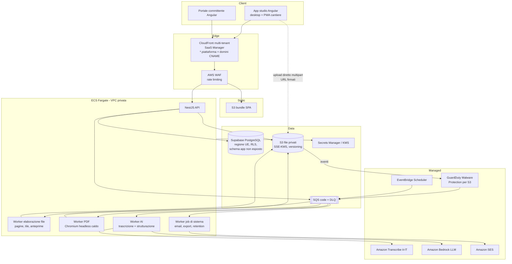

# 14. Architettura di riferimento (Angular · NestJS · PostgreSQL · AWS)

> **Stato:** indicativa. Questo capitolo traduce i vincoli `V-01..V-07` in un'architettura di partenza e rimanda ai requisiti che ogni scelta soddisfa. Le decisioni definitive si formalizzano come **ADR** in `docs/architecture/adr/` (elenco al §14.8). In caso di conflitto, **i requisiti funzionali dei capitoli 1–13 prevalgono** su questo capitolo.

## 14.1 Stack

| Livello | Scelta | Motivazione / requisiti |
|---------|--------|-------------------------|
| Frontend | **Angular 20/21**: signals, componenti standalone, change detection zoneless, `@angular/service-worker` per la PWA | V-01; FR-M4-01; NFR-PERF-03/09 |
| Backend | **NestJS** (TypeScript) su Node.js LTS | V-02; moduli per contesto di dominio |
| Database | **PostgreSQL gestito su Supabase** (regione UE). Alternativa a regime: Amazon RDS/Aurora PostgreSQL. Il codice resta PostgreSQL standard, senza dipendenze dalle API proprietarie di Supabase, così la migrazione resta possibile | V-03; RLS per BR-04; `numeric` per BR-22; JSONB per profili e snapshot |
| Monorepo | **Un solo repository** per backend, frontend e librerie condivise, con npm workspaces (ADR-001) | V-05 (motore R.A.I. condiviso), tipi e contratti condivisi |
| Infrastruttura | **AWS**, regione primaria UE | V-04, V-07 |
| IaC | AWS CDK in TypeScript (stesso linguaggio del resto) — o Terraform | NFR-MAINT-03 |
| CI/CD | GitHub Actions con federazione OIDC verso AWS (nessuna chiave statica) | NFR-SEC-11 |

### Regione

- **Proposta: `eu-central-1` (Francoforte) come regione primaria** per tutti i servizi. Motivo: **Amazon Transcribe non è disponibile in `eu-south-1` (Milano)**, mentre in Francoforte sono disponibili sia la trascrizione batch sia quella in streaming. Tenere dati ed elaborazioni nella stessa regione semplifica latenza, costi di trasferimento e documentazione privacy.
- Alternativa: dati in `eu-south-1` (Milano) ed elaborazioni AI in `eu-central-1`. Resta tutto nell'UE, ma aumentano complessità e trasferimenti tra regioni.
- **Backup / DR:** copia in una seconda regione UE (es. `eu-west-1` o `eu-south-1`) — NFR-AVAIL-04.
- ⚠️ La disponibilità dei servizi e dei modelli per regione cambia nel tempo: va verificata al momento di scrivere l'ADR-002.

## 14.2 Vista d'insieme



## 14.3 Decisioni per area, con i requisiti collegati

### Multi-tenancy e domini (M0)

| Tema | Proposta | Requisiti |
|------|----------|-----------|
| Modello di isolamento | **Database condiviso, schema condiviso**, colonna `tenant_id` + **Row-Level Security** di PostgreSQL. A ogni transazione l'API imposta il tenant corrente (es. `SET LOCAL app.tenant_id`) e le policy RLS filtrano. Un ruolo DB applicativo **senza** `BYPASSRLS` | BR-04, TC-SEC-01 |
| Risoluzione del tenant | Dall'header `Host` (sottodominio o dominio personalizzato) → tabella `custom_domain`/`tenant.slug` → contesto della richiesta. Mai da parametri del client | BR-04, FR-M0-06/07 |
| Sottodomini | Certificato wildcard ACM (`*.{dominio-piattaforma}`, in `us-east-1` come richiesto da CloudFront) | FR-M0-06 |
| Domini personalizzati | **CloudFront SaaS Manager**: distribuzione multi-tenant con un "distribution tenant" per ogni dominio dello studio e certificato gestito da CloudFront (emissione, validazione e rinnovo automatici) | FR-M0-07, SM-DOMINIO |
| Branding senza "flash" | `index.html` neutro (splash senza marchio) → chiamata `GET /public/tenant-context` (in cache sulla CDN per host, invalidata al salvataggio del branding) → applicazione dei design token come CSS custom properties **prima** del render dei componenti. Logo servito da CDN | NFR-BRAND-01/03, NFR-PERF-08 |
| Email per tenant | Amazon SES: identità di dominio della piattaforma come default; **Should**: identità verificate per dominio dello studio (Easy DKIM) | FR-M0-09 |

### Autenticazione (MT, M1)

| Tema | Proposta | Requisiti |
|------|----------|-----------|
| Utenti dello studio | **Supabase Auth** (proposta di ADR-003, `Q-29`): email/password con verifica, OAuth Google/Microsoft (FR-M6-01), MFA TOTP. NestJS verifica i JWT di Supabase (chiavi JWKS) e ricava l'utente; **tenant e ruolo li decide il database applicativo** (membership), non i claim del token. Alternative scartate per ora: Amazon Cognito, autenticazione interna | FR-MT-01/02, FR-M6-01 |
| Committenti | **Servizio interno** (non Cognito): token opachi (256 bit, salvati come hash), sessioni con cookie `HttpOnly`, OTP via SES, rate limiting (WAF + applicativo) | FR-M1-05/06, FR-M2-15, BR-03 |
| Autorizzazione | Guard NestJS per ruolo + policy ABAC (assegnazione, stato della risorsa, autore) centralizzate in un modulo `authz`, **più** RLS nel database | Cap. 2, BR-04 |

### File e revisione (M2)

| Tema | Proposta | Requisiti |
|------|----------|-----------|
| Upload | Upload **diretto dal browser a S3** con URL firmati multipart (riprendibili), in un prefisso di quarantena; conferma all'API a upload completato | FR-M2-01, FR-M4-14 |
| Antimalware | **GuardDuty Malware Protection for S3** sul bucket di quarantena → evento → promozione del file o blocco | NFR-SEC-08, EC-03 |
| Elaborazione | Worker con libvips (`sharp`) per immagini e tile (formato DeepZoom/IIIF), PDFium/Poppler per la rasterizzazione delle pagine; esecuzione in container isolato senza accesso a Internet | FR-M2-02, EC-01/02 |
| Viewer | Viewer deep-zoom (es. OpenSeadragon) integrato in Angular, con overlay dei pin in coordinate normalizzate | FR-M2-06/07, BR-20 |
| Download | URL firmati S3 (≤ 5 minuti) generati dopo il controllo dei permessi; bucket con Block Public Access | NFR-SEC-03/04 |

### Motore R.A.I. (M3)

| Tema | Proposta | Requisiti |
|------|----------|-----------|
| Libreria | `libs/rai-engine`: TypeScript **puro** (nessuna dipendenza dal framework), funzioni senza effetti collaterali, aritmetica decimale con una libreria dedicata (es. `decimal.js` o `big.js`) | V-05, BR-22, FR-M3-08 |
| Profili | Parametri in JSON validati da **JSON Schema** condiviso (validazione in client, API e DB) | FR-M3-01 |
| Test | Corpus TC-R come file di fixture, eseguito in CI sia nel runtime del browser (test Angular) sia in Node (test NestJS) | FR-M3-10, TC-R-99 |

### Cantiere offline (M4)

| Tema | Proposta | Requisiti |
|------|----------|-----------|
| App shell | `@angular/service-worker` per la cache dell'app e dei dati di riferimento (commesse, contatti, imprese) | FR-M4-01, FR-M4-14 |
| Coda offline | IndexedDB (es. tramite Dexie) con coda di operazioni e blob; servizio di sincronizzazione Angular che si attiva su `online`, all'apertura e a intervalli; id client UUID v7 e chiavi di idempotenza | BR-24, EC-07/08 |
| Audio | `MediaRecorder` con `timeslice` di 5 s e salvataggio progressivo dei blocchi in IndexedDB; wake lock | FR-M4-08, EC-06 |
| Normalizzazione dell'audio | Lato server (ffmpeg nel worker) in un formato accettato dall'ASR | NFR-COMP-03 |

### AI (M4)

| Tema | Proposta | Requisiti |
|------|----------|-----------|
| ASR | **Amazon Transcribe** batch, lingua `it-IT`, **custom vocabulary** con i termini edilizi (FR-M4-09), nella regione primaria UE | FR-M4-09, NFR-PRIV-01 |
| Strutturazione | **Amazon Bedrock** con un modello LLM in grado di produrre JSON strutturato (tool use / output con schema), in regione UE o con un profilo di inferenza limitato all'UE; Bedrock non usa i dati dei clienti per addestrare i modelli | FR-M4-10, NFR-PRIV-02 |
| Astrazione | Interfacce `SpeechToTextProvider` e `ReportStructuringProvider` nel backend, con adapter per fornitore | NFR-AI-03, R-14 |
| Prompt | Versionati nel repository; suite di valutazione (corpus TC-AI) eseguita in CI su richiesta | NFR-AI-02/04 |

### Documenti (M5)

| Tema | Proposta | Requisiti |
|------|----------|-----------|
| Motore PDF | Template HTML/CSS versionati + **Chromium headless** in un pool di istanze **già avviate** nel worker PDF (per stare sotto i 3 s); in alternativa una libreria di impaginazione programmatica. Da decidere in ADR-006 dopo un prototipo di prestazioni | NFR-PERF-01, FR-M5-00 |
| PDF/A | Post-elaborazione per la conformità PDF/A-2b e validazione automatica (es. veraPDF) in CI sui template | FR-M5-00 |
| Hash e archiviazione | SHA-256 calcolato dal worker, salvato in `document` e nell'audit; file in S3 con **Object Lock** (modalità governance) per i documenti definitivi — Should | BR-09 |

### Email, job pianificati, osservabilità, sicurezza

| Tema | Proposta | Requisiti |
|------|----------|-----------|
| Email | Amazon SES + configuration set; eventi di bounce e complaint via SNS → SQS → aggiornamento dello stato del contatto | FR-MT-06, EC-16, R-12 |
| Job pianificati | **EventBridge Scheduler** per: scadenza dei token dopo il periodo di grazia, retention (audio, IP), verifiche DNS, promemoria delle scadenze di revisione, digest delle notifiche | BR-03, PRIV-03, FR-M0-07, FR-M2-05 |
| Code | SQS con dead-letter queue e retry con backoff; code distinte per tipo di job (isolamento dei carichi) | SM-JOB-AI, NFR-AVAIL-06 |
| Osservabilità | Log JSON su CloudWatch Logs; metriche e allarmi CloudWatch; tracing OpenTelemetry → AWS X-Ray; tracciamento degli errori frontend con rimozione dei dati personali e hosting UE | NFR-OBS-01..04 |
| Sicurezza perimetrale | AWS WAF (managed rules + rate limiting per IP su login, OTP e token); header di sicurezza impostati da CloudFront (response headers policy) | NFR-SEC-05/12 |
| Chiavi e secret | KMS (chiavi gestite dal cliente per S3 e RDS), Secrets Manager con rotazione | NFR-SEC-02/11 |
| Governance | AWS Organizations con account separati per dev, staging e prod; CloudTrail organizzativo; GuardDuty; Security Hub | NFR-SEC-16/17 |
| Backup | Backup gestiti di Supabase + **Point-in-Time Recovery** (add-on, da attivare prima di avere dati reali) + dump logico periodico cifrato su S3 in un'altra regione UE; S3 versioning + replica cross-region | NFR-AVAIL-02/04 |
| Pagamenti e fatturazione | Stripe Billing (Checkout, Customer Portal, webhook verso `/api/v1/webhooks/stripe`) + provider SDI via API, eseguiti dal worker con code idempotenti | FR-M6-06/07, BR-30 |
| Entitlements | Modulo NestJS `entitlements` unico: legge la versione del piano e gli override, espone un guard/decorator (es. `@RequiresEntitlement('projects.active.max')`) usato da tutti i moduli | FR-M6-05, BR-28 |

## 14.4 Struttura del monorepo (proposta)

```
apps/
  api/                 NestJS — API REST (+ webhook Stripe)
  worker/              NestJS standalone — consumer delle code (file, pdf, ai, billing, jobs)   [step successivi]
  web/                 Angular — app dello studio + rotte /field (PWA cantiere) + portale committente   [dopo il BE]
packages/
  rai-engine/          Motore di calcolo R.A.I. (TS puro, condiviso FE/BE)
  contracts/           DTO, enum, codici d'errore, JSON Schema condivisi
supabase/
  migrations/          Migrazioni SQL versionate (schema, RLS, funzioni)
  seed.sql             Dati iniziali (piani, profili normativi di sistema)
infra/                 IaC AWS   [step successivi]
docs/
  afu/                 Questo documento
  architecture/adr/    Architecture Decision Records
  development/         Roadmap di sviluppo e guide
```

**Nota sulla PWA:** si propone di tenere la PWA di cantiere **dentro** l'app dello studio (stessa identità e stesso deploy, service worker attivo solo sulle rotte `/field`). Un'app separata va valutata se il budget del bundle (NFR-PERF-09) non viene rispettato.

## 14.5 Contratti API (linee guida)

- REST JSON, versionato per path (`/api/v1/...`), specifica OpenAPI generata da NestJS (NFR-MAINT-05).
- Separazione netta tra le superfici: `/api/v1/studio/**` (utenti dello studio), `/api/v1/portal/**` (committente), `/api/v1/admin/**` (Platform Admin), `/api/v1/public/**` (contesto del tenant, pagine di accesso).
- Header `Idempotency-Key` obbligatorio su approvazione, finalizzazione, pubblicazione, invio documenti e su tutte le operazioni della coda offline (EC-22, BR-24).
- Formato d'errore uniforme: `{ "error": { "code": "VERSION_FROZEN", "message": "…", "requestId": "…", "details": {…} } }` con i codici definiti nelle BR (cap. 6).
- Paginazione a cursore per gli elenchi potenzialmente lunghi (audit, attività, foto).

## 14.6 Ambienti

| Ambiente | Scopo | Dati |
|----------|-------|------|
| `dev` | Sviluppo e anteprime delle PR | Sintetici |
| `staging` | Collaudi di milestone con lo studio partner (UAT) | Realistici; dati personali reali solo dopo DPIA e informative (cap. 12) |
| `prod` | Beta con lo studio partner | Reali |

## 14.7 Stima degli elementi di costo da monitorare (Beta)

Componenti a costo variabile da tenere sotto controllo (R-09, NFR-AI-05): minuti di Amazon Transcribe, token Bedrock per sopralluogo, storage S3 e trasferimento CloudFront (tavole e tile), ore dei worker Fargate (soprattutto il pool PDF sempre attivo), RDS Multi-AZ, tenant di CloudFront SaaS Manager, SES. Allarmi di budget AWS per ambiente fin dalla MS0.

## 14.8 ADR da redigere (MS0)

| ADR | Decisione | Requisiti che la guidano |
|-----|-----------|--------------------------|
| ADR-001 | Monorepo e struttura dei progetti | V-05 |
| ADR-002 | Regione AWS primaria e strategia di DR | V-04, V-07, NFR-AVAIL |
| ADR-003 | Autenticazione degli utenti dello studio (Cognito vs interna) | FR-MT-01/02 |
| ADR-004 | Isolamento multi-tenant (schema condiviso + RLS) e ORM/query builder compatibile con RLS e `SET LOCAL` per transazione | BR-04 |
| ADR-005 | Domini personalizzati con CloudFront SaaS Manager | FR-M0-07 |
| ADR-006 | Motore di generazione PDF (con prototipo di prestazioni ≤ 3 s) | NFR-PERF-01 |
| ADR-007 | Fornitori ASR/LLM e strategia di valutazione | FR-M4-09/10, Q-22 |
| ADR-008 | Strategia offline e sincronizzazione della PWA | FR-M4-14 |
| ADR-009 | Viewer deep-zoom e formato dei tile | FR-M2-06 |
| ADR-010 | Libreria di aritmetica decimale e contratto del motore R.A.I. | BR-22 |
| ADR-011 | Motore entitlements e modello piani/abbonamenti | FR-M6-05, BR-28 |
| ADR-012 | Integrazione pagamenti (Stripe) e fatturazione elettronica (SDI) | FR-M6-06/07, BR-30 |

Gli ADR si trovano in [`docs/architecture/adr/`](../architecture/adr/README.md).
